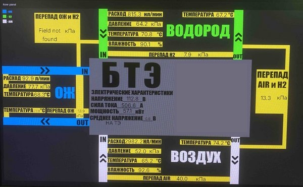

# Grafana

Grafana используется в проекте для визуализации данных, получаемых в процессе испытаний батареи топливных элементов.

На основе данных, записанных Node-RED в InfluxDB, был разработан информационный дашборд в виде мнемосхемы испытательной системы.

Дашборд позволяет в реальном времени контролировать основные параметры работы системы, включая:

* параметры водородного контура;
* параметры воздушного контура;
* параметры контура охлаждающей жидкости;
* перепады давления;
* электрический ток и напряжение;
* расчётную электрическую мощность.

## Мнемосхема

Ниже представлена фотография дашборда, сделанная во время проведения испытаний.

