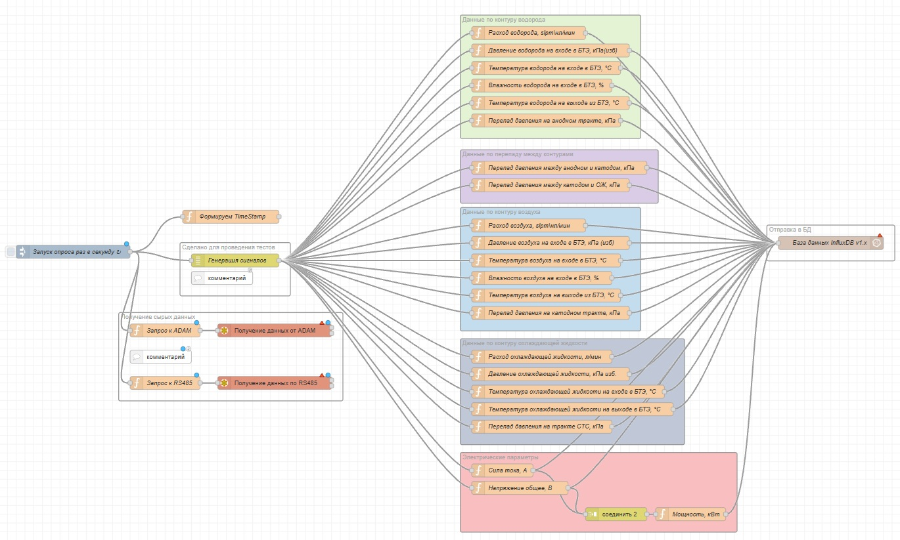

# Node-RED система сбора и обработки данных при испытаниях батареи топливных элементов.

Система разработана для автоматизированного сбора параметров испытательного стенда, преобразования сырых данных измерительных устройств в физические величины, формирования единой структуры тегов и передачи результатов в InfluxDB для последующей визуализации в Grafana.

## Обрабатываемые данные

Система предусматривает сбор и обработку параметров:

- расход водорода и воздуха;
- давление и перепады давления;
- температура и влажность газовых контуров;
- параметры охлаждающей жидкости;
- ток и напряжение;
- расчёт электрической мощности.

Для каждого параметра выполняется преобразование исходного значения в физическую величину и присваивается уникальный тег для записи в базу данных.

## Структура Node-RED flow

Ниже представлена структура flow системы сбора и обработки данных.

## Архитектура

        ADAM / Modbus TCP
                │
                │
        Modbus RTU devices
                │
                ▼
        ┌───────────────┐
        │   Node-RED    │
        │               │
        │ Data acquire  │
        │      ↓        │
        │ Conversion    │
        │      ↓        │
        │ Tagging       │
        │      ↓        │
        │ Calculations  │
        └───────┬───────┘
                │
                ▼
        ┌───────────────┐
        │   InfluxDB    │
        └───────┬───────┘
                │
                ▼
        ┌───────────────┐
        │    Grafana    │
        │  Dashboard /  │
        │  Mnemoscheme  │
        └───────────────┘